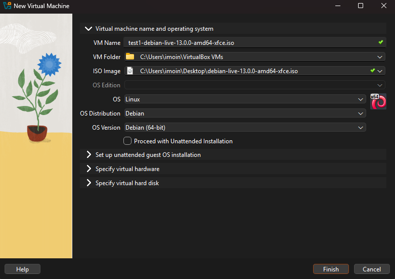
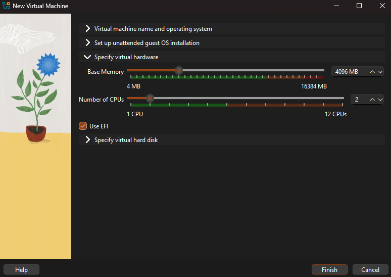
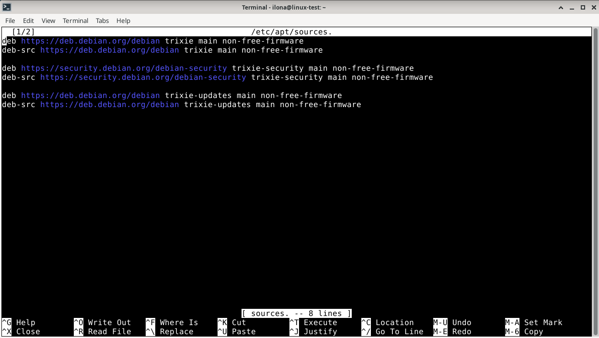

# H1 - Oma linux

Tässä harjoituksessa tein tiivistelmän ja asensin Linuxin virtuaalikoneelle. Huomasin, että h0-raportissa olevat markdownit eivät ainakaan itselläni näkynyt. Siitä huolimatta tein tämän raportin samalla lailla ja lisäsin ottamani kuvat tämän ohjeen 
mukaisesti: https://github.com/terokarvinen/dreamhugmonkey#adding-images-to-markdown. Tein tämän hieman myöhään, joten koitan ratkoa markdown-ongelman seuraavaa raporttia tehdessä.

Tehtävänanto: https://terokarvinen.com/linux-palvelimet/#h1-oma-linux

## Tiivistelmä Raportin kirjoittaminen-ohjeesta: 

Ohje: https://terokarvinen.com/2006/raportin-kirjoittaminen-4/

-Raportoinnissa tärkeintä on kertoa täsmällisesti, mitä on tehty ja mitä on tapahtunut.
-Tämä onnistuu helpoiten, kun tekee raportin ja ottaa muistiinpanoja samalla, kun tekee itse tehtäviä.
-Muiden on pystyttävä tehdä samat asiat ja saada sama lopputulos pelkän raportin avulla.
-Kaikki yksityiskohdat tulee kirjata riippumatta siitä, onnistuitko vai et.
-Tekstin täytyy olla helppolukuista ja se pitää kirjoittaa käyttäen huolellista kieltä.
-Eri alustoilla käytetään eri standardeja. Weppisivulla ei tarvitse noudattaa Helian julkaisuohjeita.
-Lähteiden viittaus on tärkeätä.
-Plagiointi on kiellettyä ja rangaistavaa. Raportoi vain tehdyistä töistä ja noudata tekijänoikeuksia.

## Linuxin asennus virtuaalikoneeseen:

Asennus tehtiin tämän ohjeen mukaan: https://github.com/johannaheinonen/johanna-test-repo/blob/main/linux-20082025.md

Avasin VirtualBoxin ja loin uuden virtuaalikoneen. Olin jo aikaisemmin ladannut kaiken tarvittavan ja asentanut linuxin, joten aloitin kaiken uudestaan ja annoin uudelle virtuaalikoneelle nimen 'test1-debian...'. Muuten kaikki syötetty tieto on samoin, kuten ohjeessa. 
Verrattuna ohjeeseen, pari asiaa oli erilaillla. 'Proceed with Unattended Installation' oli valmiiksi valittuna, joten poistin sen. Normal Startin sijaan valitsin Start with GUI. 

  
  
  

Aloitin virtuualikoneen valitsemalla 'Start with GUI' ja sen jälkeen 'Live System (amd64). Selain toimi ja kokeilin pari komentoa terminaalissa, mitkä myös toimi.

  
  

Palasin takaisin Live Boot Menuun komennolla sudo reboot ja aloitin varsinaisen asennuksen. Syötin ohjeen mukaiset tiedot ja jatkoin asennukseen, joka onnistui.
  
Viimeisessä vaiheessa en onnistunut. En saanut apt-get update-komentoa toimimaan. Kokeilin käyttää sudo nano /etc/apt/sources. List-komentoa ja sain listatut komennot lisättyä sinne, mutta apt-get update-komento ei silti toiminut.

  
  

