# H2 Komentaja Pingviini

Tehtävänanto: https://terokarvinen.com/linux-palvelimet/#h2-komentaja-pingviini

## x) Tiivistys

Tein tiivistyksen sivusta: https://terokarvinen.com/2020/command-line-basics-revisited/?fromSearch=command%20line%20basics%20revisited.

-Komentorivin avulla päästään käsiksi hakemistoihin ja käsitellään tiedostoja.

-Komentoja käyttäen siirrytään hakemistosta toiseen. Tekstieditoreja voidaan käyttää tiedostojen käsittelyssä.

-Tärkeimmät ja keskeisimmät hakemistot ovat /, /home/, /home/ilona/, /etc/, /media/ ja /var/log/.

-Valtaosa toiminnoista tehdään ’Minimum Privilege’ käytännöllä. Korkeammalla oikeudella tehdään esim. sovellusten asennuksia ja poistoja, luodaan käyttäjiä ja hallinnoidaan oikeuksia.

-Kaikkea ei tarvitse muistaa. Terminaalissa on help-menu ja komentoterminaali osaa tarvittaessa näyttää miten komennon voi kirjoittaa loppuun tai jopa täyttää sen automaattisesti.

## a) Micron asennus

Aloitin harjoituksen avaamalla virtuaalikoneen ja ajamalla komennon sudo apt-get update. Micron asennuksen tein noudattamalla Tero Karvisen ohjeistuksia sivulta: https://terokarvinen.com/2020/command-line-basics-revisited/?fromSearch=command%20line%20basics%20revisited.

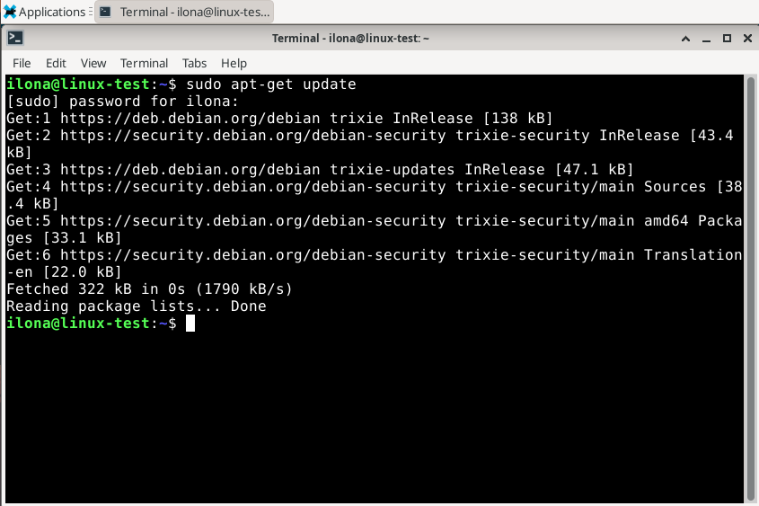

Vaikka tarvittavan paketin nimi oli tiedossa, kokeilin silti huvikseni komentoa ’Apt-cache search micro’. Terminaaliin ilmestyi pitkä lista, josta löysin halutun sovelluksen. Asensin sen käyttämällä komentoa ’sudo apt-get -y install micro’.

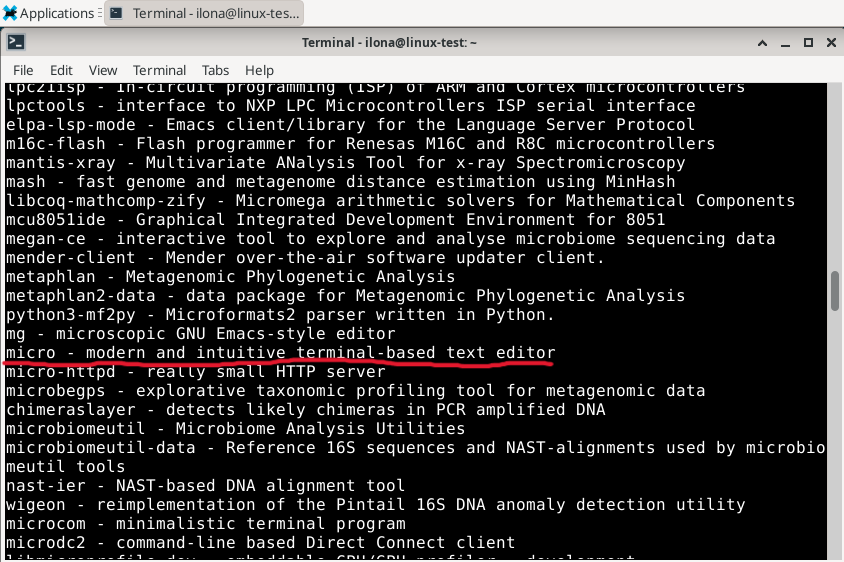

Tämän jälkeen ajoin komennon ’dpkg - - listfiles micro’.

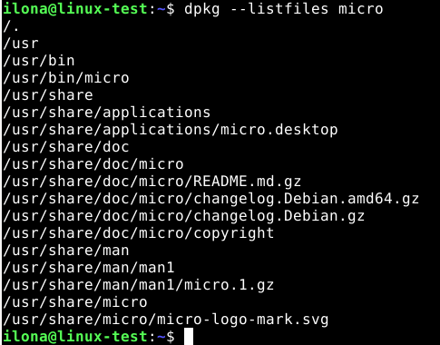

Varmistin sovelluksen toimivuuden komennolla ’micro’.

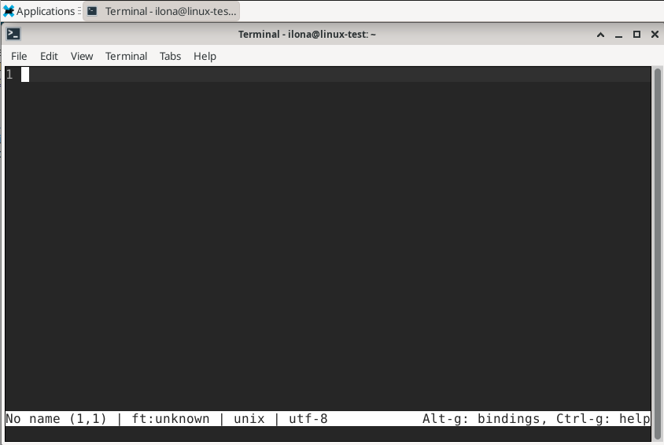

## b) Komentoriviohjelmat

Saman ohjeen lopussa oli esimerkki apt-get komennosta, jolla pystyi lataamaan useamman ohjelman kerralla.

Esimerkki: $ sudo apt-get -y install krita blender vlc tree httpie curl tmux python3-py

Ohjelmia etsiessä unohdin käyttää edellistä komentoa ja päädyin lataamaan kaikki yksittäin komennolla ’sudo apt-get -y install’. Pääsijaisesti etsin jotain pientä ja hauskaa, jolla ei ollut isompaa käyttötarkoitusta. Päädyin lataamaan nämä kolme nsnake, sl, cmatrix.

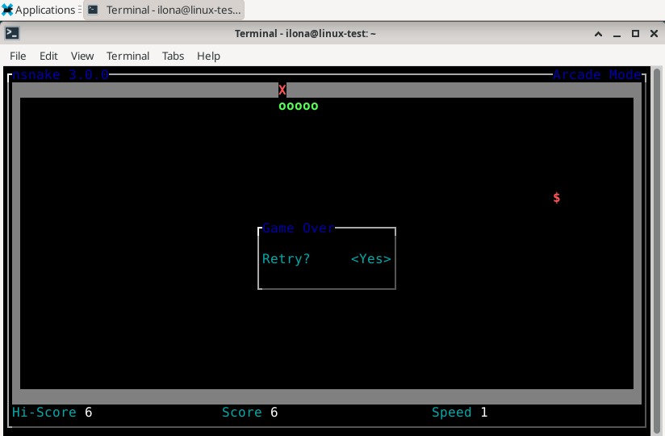

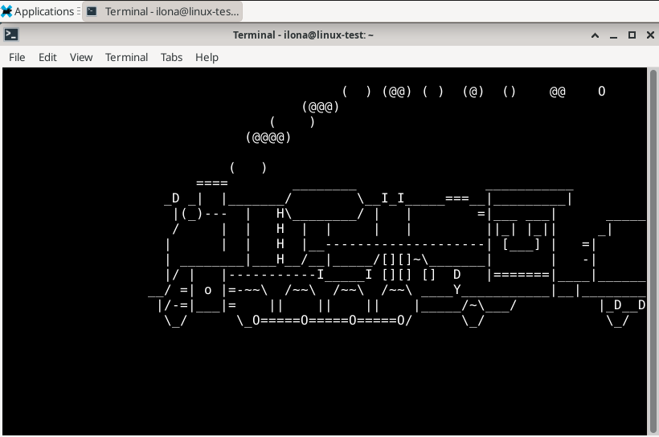

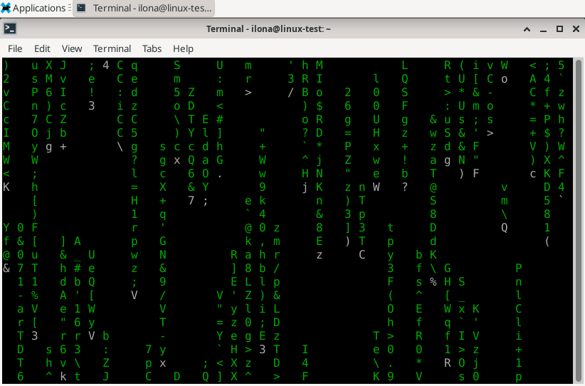

## c) FHS

Tässä tehtävässä pyydettiin listaamaan ’Important directories’-osiossa olevat kansiot ja esittelemään niissä olevan tiedoston tai kansion. Kyseiset kansiot ovat /, /home/, /home/ilona/, /etc/, /media/ ja /var/log/. En tiedä ymmärrsinkö ohjeistuksen "kuvaava esimerkki" oikein, joten toivon, että seuraavat esimerkit kelpaavat.

### / eli juurihakemisto

Koitin mennä hakemistoihin ja avata kansiot ulkomuistista, joten meni pari yritystä ennen kuin pääsin juurihakemistoon ja siellä olevaan dev-hakemistoon. Menin hakemistoon komennolla 'cd /', varmistin sijainnin komennolla 'pwd' ja komennolla 'ls /' sain esille hakemiston.

Samoilla komennoilla avasin juurihakemistossa olevan dev-hakemiston.

### /home/

Juurihakemistosta siiryin suoraan /home/-hakemistoon.

### /home/ilona/

Käytin samoja komentoja kuin ensimmäisessä, mutta en saanut näkyville mitään. Oletan tämän johtuvan siitä, että en ole itse luonut hakemistoon mitään.

### /etc/

Tämä oli huomattavasti isompi hakemisto. Kokeilin aluksi avata modulesia, mutta se ei onnistunut. /etc/lynx sen sijaan onnistui ja kurkkasin, mitä sen sisällä on.

### /media/

Tässäkään hakemistossa ei näkynyt mitään. Oletan sen johtuvan siitä, että siellä ei ole mitään tai, että minulla ei ole tarvittavia oikeuksia.

### /var/log/

Kokeilin avata hakemistossa olevaa README-tiedostoa, mutta en saanut sitä auki. Googlettamalla sain selville, että 'cat'-komento saattaisi toimia. Sain kuitenkin seuraavanlaisen huomautuksen.

Kokeilin aptia ja sen avaamisessa onnistuin.

## d) The Friendly M

Aloitin syöttämällä ’man grep’ terminaaliin ja pitkä lista ilmestyi, jossa selitettiin grepin käyttö kokonaisuudessa. Löysin saman ohjeen googlesta, jota käytin lukemisen helpottamiseksi: https://man7.org/linux/man-pages/man1/grep.1.html. 

Päädyin lopuksi kuitenkin hakemaan esimerkkejä täältä: https://www.geeksforgeeks.org/linux-unix/grep-command-in-unixlinux/

Ajattelin aluksi kokeilla komentoja itse, mutta edellisen tehtävän jälkeen en koe saavani hyviä tuloksia.

Sanan hakeminen tiedostosta: grep "python" notes.txt

Sanan hakeminen tiedostosta, jossa on isoja tai pieniä kirjaimia tai molempia: grep -i "UNix" geekfile.txt

Näytä vain täsmäävä string, eikä koko riviä: grep -o "unix" geekfile.txt

## e) Pipe

Tämä oli uusi asia, joten googletin sen ja käytin tätä sivua tämän tehtävän tekemisessä: https://www.geeksforgeeks.org/linux-unix/piping-in-unix-or-linux/. Pipe eli | merkkiä käytetään kahden komennon yhdistämisessä. Esimerkiksi ’more’-komennon kanssa

Esimerkki: ls -l | more

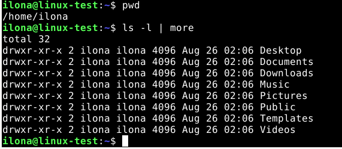

## f) Rauta

Kokeilin suoraan syöttää komennon ’sudo lshw -short -sanitize’, mutta terminaali ei löytänyt komentoa ’lshw’, joten latasin sen ja suoritin komennon uudelleen.

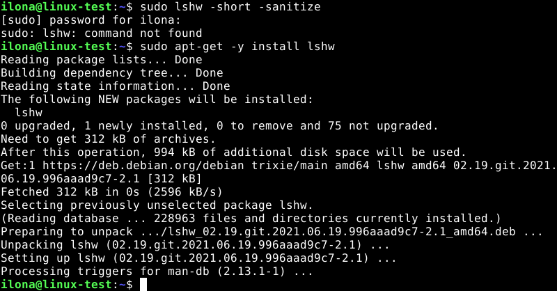

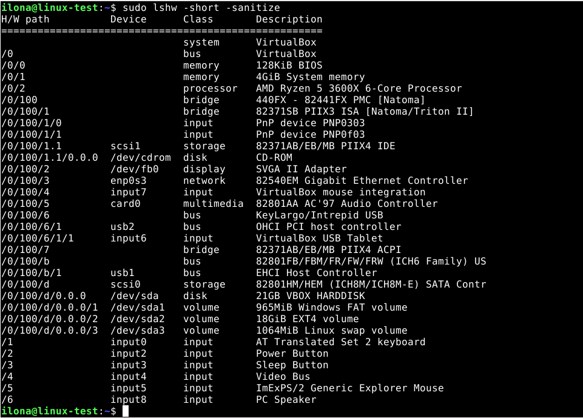

https://linuxhandbook.com/lshw-command/. 

’sudo lshw’ antaa kaiken tiedon koneen raudasta ja ’-short -sanitize’ muotoilee syötetyn tiedon. Komento listasi laitteet ja niiden luokan sekä lyhyen kuvauksen. Listassa oli myös H/W path, jota en entuudesta tuntenut. Löysin foorumilta vuodelta 2001 hyvän selityksen H/W pathille: https://community.hpe.com/t5/hpe-9000-and-hpe-e3000-servers/h-w-path/td-p/2555697. 

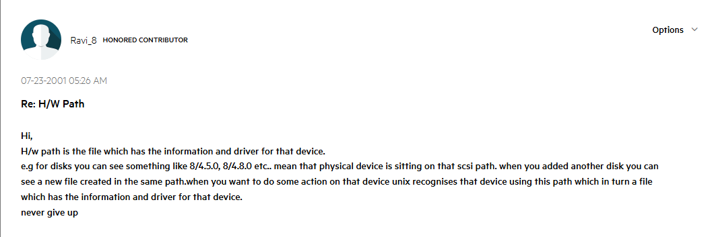

En itse valitettavasti osaa ainakaan tässä vaiheessa selittää ja analysoida listausta paremmin.
